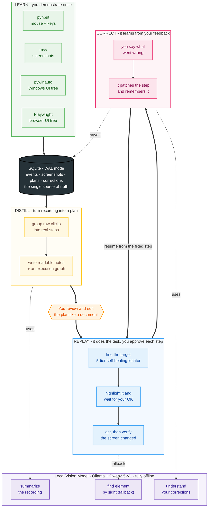

# MimicAgent

MimicAgent is a desktop agent that learns a computer workflow by watching you do it once, and then does it for you.

There is no scripting and no prompting. You press a Learn button, you go through your task the way you normally would, and the agent watches quietly in the background. It notices where you click, what you type, and which actual interface element you touched at each step. When you are done it turns that recording into a plan written in plain language that you can read and edit. Later you press Play, feed it a new input, and it walks through the same workflow, stopping at every step to show you what it is about to do and waiting for your go-ahead. If it gets a step wrong you stop it, tell it what went wrong in normal words, and it fixes that step and remembers the fix so it does not make the same mistake again.

The whole thing runs on your own machine. No cloud, no API keys, no per-token cost. It is built to stay light enough to run on an ordinary 16GB laptop without turning the fans on.

The example I built it around is my own job hunt. The workflow is: find a recruiter who is hiring on LinkedIn, pull their email through a browser extension, draft an outreach message and a resume tailored to the role, and save everything into a folder named after the company. That is a tedious loop I run over and over, which makes it the perfect thing to hand to an agent. Nothing about the design is specific to job applications though. Any repetitive multi step desktop task fits the same mold.

## Why I built it the way I did

Most tools that automate a screen do it by remembering pixel positions. Click at x=340, y=220. That breaks the instant a window moves or a page reflows, which on a real website is constantly. So MimicAgent does not lead with pixels. It leads with the accessibility tree, which is the structured description of the interface that the operating system already keeps for screen readers. When you click a button, Windows already knows it is a button named "Connect", and I can read that in a couple of milliseconds without looking at a single pixel. That semantic information is what makes a recording survive into tomorrow, when the layout has shifted slightly but the button named "Connect" is still called "Connect".

Vision only comes in as a backup. Some apps draw their own interface onto a blank canvas and expose nothing to the accessibility tree. For those cases, and only those, a local vision model looks at a screenshot and finds the element. Keeping the slow, heavy vision step off the main path is the entire reason this can run offline on a normal laptop instead of needing a datacenter GPU.

## The big picture

Here is the whole system across all four stages. Follow the thick arrows for the main path, and the dotted arrows for the moments it leans on the local vision model.



The green Learn block is four listeners running at once while you work. Everything they see flows into the SQLite database in the middle, which is the single place the whole system reads from and writes to. Once you stop recording, the yellow Distill block reads the raw events back out, asks the local vision model to turn clusters of clicks into clean readable steps, and produces two forms of the same workflow: notes you can edit, and a graph the executor can run. You get to review and edit those notes before anything runs. The blue Replay block then walks the graph one step at a time, finding each target, highlighting it, waiting for your approval, acting, and checking the screen actually changed before moving on. The red Correct block is where your feedback rewrites a step and gets saved into memory, so the resume picks up from the fixed step and the lesson is remembered next time. The purple block at the bottom is the local vision model, and the dotted lines show it is only pulled in for three specific jobs rather than running constantly.

## Where the project is right now

Phase 1, the recorder, is finished and working. Everything downstream reads from the database it produces, so getting this layer solid was the priority before building anything on top of it.

## Phase 1 in detail: the recorder

The recorder has one job: watch you work and write down everything that matters, without ever slowing your machine down. That last part sounds easy and is actually the whole challenge, so the design is built around it.

Here is exactly what happens, start to finish, every time you click something.


The diagram splits into three stages, and the split is the important idea.

Stage one catches the action. When you click or type anywhere, a pynput global hook picks it up. A global hook means it sees your input no matter which app is focused, because it taps into the input at the operating system level rather than waiting for its own window to be active. This is what lets it watch you work in Chrome and Gmail and File Explorer even though the recorder itself is just running in the background. The one firm rule here is that this step has to be nearly instant. The hook callback runs inside the same pipeline the OS uses to deliver your click to the app you clicked on, so if the callback does anything slow, your actual mouse freezes for the whole system. So all it does is jot down a tiny note about the event and drop it on a queue, then get out of the way immediately.

The queue in the middle is the trick that makes the whole thing smooth. It is just a line that events wait in. The fast side drops events onto it and never waits. The slow side picks them up whenever it is ready. If you click five times quickly, all five land in the queue instantly and get processed one by one afterward, so nothing is ever lost and nothing ever lags.

Stage two does the slow work, and it runs on a completely separate thread so none of it can touch your mouse. A writer thread pulls the next event off the queue and does two genuinely slow things. First it asks Windows, through pywinauto and the UI Automation system, what interface element sits at those coordinates, and gets back something meaningful like the button named "Connect". This is the step that turns a meaningless coordinate into something the agent can actually understand and find again later. Second it takes a screenshot of the screen at that exact moment with mss, so there is a visual record of the situation, which becomes the backup for any element the accessibility tree could not name.

Stage three saves everything into a SQLite database running in write ahead logging mode. Write ahead logging lets the writer keep saving while other parts of the program read at the same time, and it keeps everything already written safe even if the program crashes in the middle of a recording. Each row holds the timestamp, the kind of event, the coordinates, the key if it was a keystroke, the name and type of the element, and the path to the screenshot.

When you press Escape to stop, the result is recording.db: your entire workflow captured as clean, queryable data, with every action tied to the element it touched and a picture of the screen at the time.

The one sentence summary worth remembering: listeners catch events, a queue passes them safely to a writer thread, and the writer thread saves the events, screenshots, and interface information into SQLite.

### What a real capture looks like

In one test run the recorder watched me open a recruiter's LinkedIn profile, click the Apollo extension to find their email, switch over to Gmail, hit Compose, and paste into the recipient field. Every one of those actions came back out of the database afterward with a timestamp, the name of the element I touched, and a screenshot, and my mouse never lagged once through the whole thing. That is the moment the project stopped being an idea and started being real.

## Roadmap

Phase 1 (Recorder) is done. Next is Phase 2, standing up the local vision model with Ollama so the recording can start becoming understanding. After that comes distillation into editable plans, the replay engine built on a state machine with human approval at each step, correction memory backed by local embeddings, an MCP server so learned workflows can be called as tools, and finally an evaluation harness and a packaged installer.

## Tech stack

Python 3.11, pynput, pywinauto on the UIA backend, mss, and SQLite in WAL mode are in use today. Coming in later phases: Ollama running a quantized Qwen2.5-VL, LangGraph for the replay state machine, Playwright over the Chrome DevTools Protocol for browser control, sqlite-vec with nomic-embed-text for correction memory, PyQt6 for the on screen overlay, the MCP SDK, and self hosted Langfuse for tracing.

## Running the recorder

```bash
pip install pynput pywinauto mss
python mini_recorder.py
```

Press Esc to stop the recording. Open recording.db afterward in any SQLite viewer to see what it captured.

A word of caution. The recorder captures screenshots and interface text of whatever is on your screen while it runs, so treat recording.db and the captures folder as private. Both are excluded from version control by the gitignore and never leave your machine.
