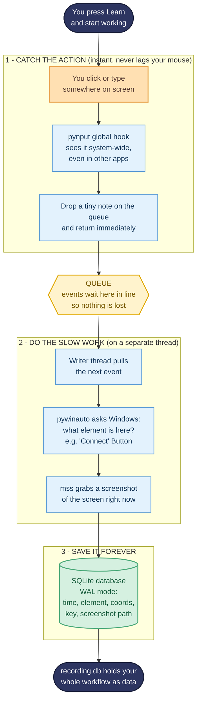
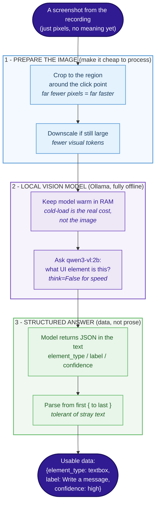
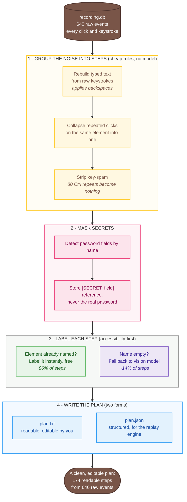
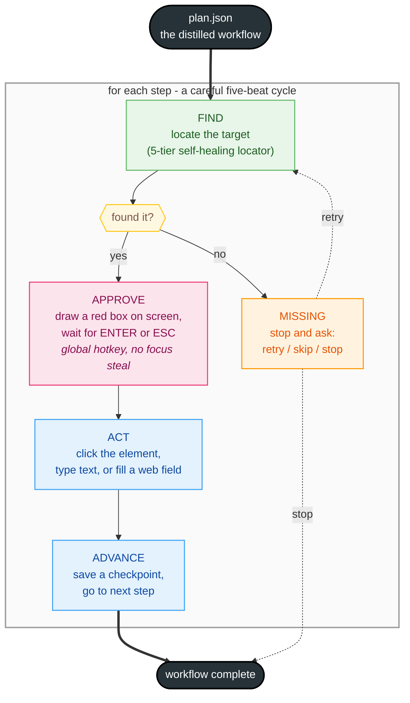
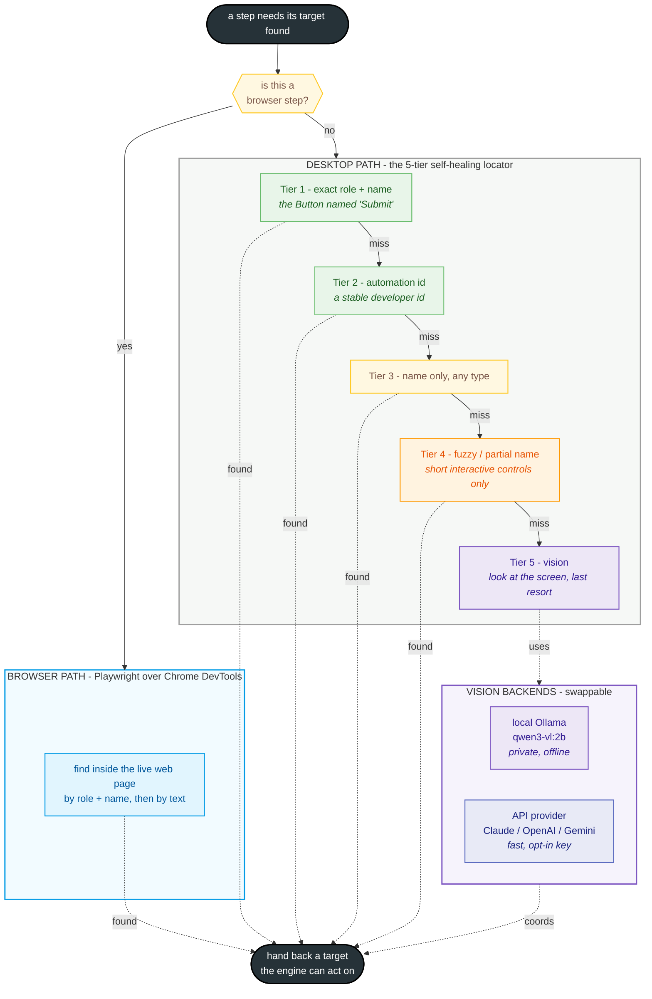

# MimicAgent

MimicAgent is a desktop agent that learns a computer workflow by watching you do it once, and then does it for you.

There is no scripting and no prompting. You press a Learn button, you go through your task the way you normally would, and the agent watches quietly in the background. It notices where you click, what you type, and which actual interface element you touched at each step. When you are done it turns that recording into a plan written in plain language that you can read and edit. Later you press Play, feed it a new input, and it walks through the same workflow, stopping at every step to show you what it is about to do and waiting for your go-ahead. If it gets a step wrong you stop it, tell it what went wrong in normal words, and it fixes that step and remembers the fix so it does not make the same mistake again.

The whole thing runs on your own machine. No cloud, no API keys, no per-token cost. It is built to stay light enough to run on an ordinary 16GB laptop without turning the fans on.

The example I built it around is my own job hunt. The workflow is: find a recruiter who is hiring on LinkedIn, pull their email through a browser extension, draft an outreach message and a resume tailored to the role, and save everything into a folder named after the company. That is a tedious loop I run over and over, which makes it the perfect thing to hand to an agent. Nothing about the design is specific to job applications though. Any repetitive multi step desktop task fits the same mold.

## Why I built it the way I did

Most tools that automate a screen do it by remembering pixel positions. Click at x=340, y=220. That breaks the instant a window moves or a page reflows, which on a real website is constantly. So MimicAgent does not lead with pixels. It leads with the accessibility tree, which is the structured description of the interface that the operating system already keeps for screen readers. When you click a button, Windows already knows it is a button named "Connect", and I can read that in a couple of milliseconds without looking at a single pixel. That semantic information is what makes a recording survive into tomorrow, when the layout has shifted slightly but the button named "Connect" is still called "Connect".

Vision only comes in as a backup. Some apps draw their own interface onto a blank canvas and expose nothing to the accessibility tree. For those cases, and only those, a local vision model looks at a screenshot and finds the element. Keeping the slow, heavy vision step off the main path is the entire reason this can run offline on a normal laptop instead of needing a datacenter GPU.

## The big picture

Here is the whole system across all four stages. Follow the thick arrows for the main path, and the dotted arrows for the moments it leans on the local vision model.


The green Learn block is four listeners running at once while you work. Everything they see flows into the SQLite database in the middle, which is the single place the whole system reads from and writes to. Once you stop recording, the yellow Distill block reads the raw events back out, groups clusters of clicks into clean readable steps, and produces two forms of the same workflow: notes you can edit, and a structured plan the executor can run. You get to review and edit those notes before anything runs. The blue Replay block then walks the plan one step at a time, finding each target, highlighting it, waiting for your approval, acting, and checking the screen actually changed before moving on. The red Correct block is where your feedback rewrites a step and gets saved into memory, so the resume picks up from the fixed step and the lesson is remembered next time. The purple block is the local vision model, and the dotted lines show it is only pulled in for three specific jobs rather than running constantly.

## Where the project is right now

Three phases are built and working, in order.

- **Phase 1 - Recorder** (done): captures any workflow to a local database.
- **Phase 2 - Local vision** (done): understands screenshots offline and identifies UI elements as structured data.
- **Phase 3 - Distillation** (done): turns a raw recording into a readable, editable, security-conscious plan.

So today MimicAgent can already **watch** a task, **understand** what is on screen, and **plan** the workflow as clean steps. What remains is the replay engine that executes the plan, the correction loop that learns from feedback, and packaging. Those are described in the roadmap at the end.

Each finished phase is walked through in detail below.

---

## Phase 1 in detail: the recorder

The recorder has one job: watch you work and write down everything that matters, without ever slowing your machine down. That last part sounds easy and is actually the whole challenge, so the design is built around it.

Here is exactly what happens, start to finish, every time you click something.



The diagram splits into three stages, and the split is the important idea.

Stage one catches the action. When you click or type anywhere, a pynput global hook picks it up. A global hook means it sees your input no matter which app is focused, because it taps into the input at the operating system level rather than waiting for its own window to be active. This is what lets it watch you work in Chrome and Gmail and File Explorer even though the recorder itself is just running in the background. The one firm rule here is that this step has to be nearly instant. The hook callback runs inside the same pipeline the OS uses to deliver your click to the app you clicked on, so if the callback does anything slow, your actual mouse freezes for the whole system. So all it does is jot down a tiny note about the event and drop it on a queue, then get out of the way immediately.

The queue in the middle is the trick that makes the whole thing smooth. It is just a line that events wait in. The fast side drops events onto it and never waits. The slow side picks them up whenever it is ready. If you click five times quickly, all five land in the queue instantly and get processed one by one afterward, so nothing is ever lost and nothing ever lags.

Stage two does the slow work, and it runs on a completely separate thread so none of it can touch your mouse. A writer thread pulls the next event off the queue and does two genuinely slow things. First it asks Windows, through pywinauto and the UI Automation system, what interface element sits at those coordinates, and gets back something meaningful like the button named "Connect". This is the step that turns a meaningless coordinate into something the agent can actually understand and find again later. Second it takes a screenshot of the screen at that exact moment with mss, so there is a visual record of the situation, which becomes the backup for any element the accessibility tree could not name.

Stage three saves everything into a SQLite database running in write ahead logging mode. Write ahead logging lets the writer keep saving while other parts of the program read at the same time, and it keeps everything already written safe even if the program crashes in the middle of a recording. Each row holds the timestamp, the kind of event, the coordinates, the key if it was a keystroke, the name and type of the element, and the path to the screenshot.

When you press Escape to stop, the result is recording.db: your entire workflow captured as clean, queryable data, with every action tied to the element it touched and a picture of the screen at the time.

The one sentence summary worth remembering: listeners catch events, a queue passes them safely to a writer thread, and the writer thread saves the events, screenshots, and interface information into SQLite.

**What a real capture looks like.** In one test run the recorder watched me open a recruiter's LinkedIn profile, click the Apollo extension to find their email, switch over to Gmail, hit Compose, and paste into the recipient field. Every one of those actions came back out of the database afterward with a timestamp, the name of the element I touched, and a screenshot, and my mouse never lagged once through the whole thing. That is the moment the project stopped being an idea and started being real.

---

## Phase 2 in detail: local vision

Phase 1 gave the agent a memory of what happened, but a screenshot is just pixels. Phase 2 gives the agent eyes: a vision model that runs entirely on your own machine and can look at a screenshot and say what a UI element is, returning the answer as structured data the rest of the agent can act on. Everything here is local, so no screen data ever leaves the machine.



The model I settled on is Qwen3-VL at the 2B size, served locally by Ollama. On a 16GB laptop with no GPU, the larger 8B model took around half an hour for a single screenshot, which is unusable, while the 2B model handles the same work in seconds once it is warm. That trade, a smaller model that fits the hardware, is the whole reason the offline promise holds.

The biggest lesson of this phase was where the time actually goes. I assumed the image size or the inference itself was the cost, but it turned out the dominant cost was cold-loading the model from disk into memory. Once the model is warm in RAM, a cropped screenshot comes back in single-digit to low-double-digit seconds; cold, it takes minutes. So the first stage of the diagram, preparing the image by cropping to the region around the click, matters less for raw speed than keeping the model warm, though cropping still helps by cutting the number of visual tokens the model has to chew through. On a machine this tight, warmth cannot be perfectly guaranteed because the operating system reclaims memory for other things, which causes occasional slow spikes, but that is acceptable because vision never runs where a user is waiting.

The third stage is the one that makes vision genuinely useful. The agent cannot act on a paragraph of description; it needs data. So instead of asking the model to describe the screen, I ask it to identify the element and return a small JSON object with an element type, a label, and a confidence. A subtle but important finding here: Ollama has a forced-JSON mode, but with this small vision model it returned empty output, so the reliable approach is to describe the exact JSON shape in the prompt, let the model produce it as normal text, and then parse it by taking everything from the first brace to the last. That tolerates any stray text the model adds around the JSON.

The reason all of this is designed as an off-to-the-side, occasional step is the core architectural bet of the whole project: the accessibility tree already names most elements for free and instantly, so vision is reserved for the small fraction of cases where the tree came back empty. Phase 3 is where that split shows up as a real number.

---

## Phase 3 in detail: distillation

Distillation is the step that turns the raw recording into a plan a human can read and edit. The recorder is faithful but noisy: typing one sentence is dozens of separate keystroke events, holding a modifier key fires it dozens of times through auto-repeat, and there are stray clicks and corrections everywhere. A useful plan should not have hundreds of raw events; it should have the handful of meaningful steps you actually intended. Distillation boils the one down to the other.



The first stage is pure pattern rules, no model needed, which is deliberate because cheap and deterministic logic should do the bulk of the cleanup. Consecutive keystrokes are gathered into a buffer and turned into a single type step, with the actual text rebuilt from the raw keys, including honoring backspaces so corrections come out as the final text. Repeated clicks on the same element collapse into one. Control-key auto-repeat, like the eighty Ctrl presses a single held key produced, simply disappears because it contributes nothing to the text.

The second stage handles credentials. When the typing went into a field whose name looks like a password field, the plan does not store what was typed. Instead it stores a reference like [SECRET: Password], so the plan records that a password goes here without ever keeping the password itself in plaintext. The real value would be pulled from a secure store at replay time, never from the plan file. This keeps the plan safe to save, edit, and share.

The third stage labels each step with a readable instruction, and this is where the core architectural bet pays off visibly. If the element already has a name from the accessibility tree, which it captured back in Phase 1, labeling is instant and free: "Click the Submit button", "Select Virginia", "Type Fairfax". Only when the name is empty does the step get handed to the Phase 2 vision model. On a full real recording, about 86 percent of steps were labeled straight from the tree with no model at all, and only about 14 percent would ever need vision. That number is the whole thesis of the project in one statistic.

The fourth stage writes the result in two forms of the same workflow. plan.txt is the human-readable version, a numbered list of plain instructions you review and edit like a document. plan.json is the structured version, carrying the action, the element details, and the secret references, which is what the replay engine will read to actually execute each step.

**What a real distillation looks like.** I recorded a complete job application on a Workday portal, start to finish: opening Overleaf, pasting and editing a resume, downloading and renaming it, then filling the entire multi-step application form with address, education, and demographic fields, and submitting. That produced 640 raw events. Distillation turned it into 174 readable steps, with the typed fields reconstructed correctly, the passwords masked, and the vast majority labeled straight from the accessibility tree. The resulting plan reads like a recipe of the whole application.

---

---

## Phase 4 in detail: the replay engine

This is the phase where MimicAgent stops being something that watches and understands, and becomes something that acts. It reads the plan from Phase 3 and performs it on a live screen, one step at a time, showing you a red box around each target and waiting for your go-ahead before it touches anything. It is the largest phase and the one that ties the whole project together: the element names captured in Phase 1 become the things it hunts for, the vision model from Phase 2 becomes its last-resort eyes, and the plan from Phase 3 becomes its script.

The engine is a small state machine. Every step travels the same five beats, and the whole thing is built so it can pause forever waiting for a human and resume from exactly where it stopped.



The reason this is a state machine and not a plain loop is the pausing. A human stops the agent, looks at the box, maybe thinks for a minute, then approves. The agent must be able to freeze at that exact point, hold everything, and pick up cleanly when the answer comes. The state machine is built with LangGraph, whose interrupt mechanism does exactly this: a node can pause the whole graph, hand a question out to the human, and resume from that spot when the answer arrives. Every step also writes a checkpoint to a small SQLite file, so a run that is stopped halfway can be resumed later from the right step rather than started over.

### Finding the target: the five-tier self-healing locator

The hardest part of replay is not clicking, it is finding. When you recorded, the screen looked one way; when you replay, a window may have moved, a page may have reflowed, a list may have scrolled. Clicking the old coordinates blindly is exactly the brittle pixel-chasing the whole project set out to avoid. So instead the engine hunts for each element by meaning, trying a series of strategies from most reliable to least, and taking the first one that works. Because it recovers when the strong strategies fail, it is called self-healing.



The clearest way to think about the tiers is finding a friend in a crowd. First you look for their face, which is the most reliable signal. That is Tier 1: match the element by both its role and its exact name, the Button actually named Submit. If that fails, you look for the bright jacket they told you they would wear, a stable identifier, which is Tier 2 matching on the developer-assigned automation id. If that fails you match on name alone regardless of type, Tier 3, since sometimes an app reports the same label under a different control type than expected. If that still fails, Tier 4 tries a fuzzy partial-name match, and if all the semantic tiers come up empty, Tier 5 falls back to actually looking at the screen with the vision model. A dumb macro only ever knows the last resort, the exact spot you agreed to meet, which is why it breaks the moment anything moves.

Tier 4, the fuzzy match, taught a real lesson and is worth calling out. The first version simply looked for any on-screen element whose name contained the search text. On a real screen that is dangerous: a code editor and a chat window both display arbitrary text, and searching for a short label happily matched a whole paragraph of source code or a message that merely contained the word. The fix was to constrain Tier 4 to short, genuinely interactive controls only, buttons and menu items and fields, and to require the found name to be close in length to what was searched for. A real button label is short; a paragraph that happens to contain the word is not. Constraining the fuzzy tier this way is the difference between self-healing and self-sabotage.

Browsers get their own path. To the desktop accessibility system a Chrome window is largely one opaque box, so finding the City field inside a web form through desktop automation is unreliable. Instead, when a step is a browser step, the engine talks to the browser directly through Playwright connected over the Chrome DevTools Protocol, which can read the page's own accessibility tree and find elements by role and name inside the page. One operational detail matters here: this attaches to a Chrome that is already running with a debugging port open, rather than launching a fresh empty browser, so it works inside your real logged-in sessions. Chrome has to be started with that port before a browser workflow runs, or the connection is simply refused.

### Acting on what was found, and knowing it worked

The five tiers hand back two different kinds of things, and the engine has to treat them differently. The desktop and browser tiers return a live handle to a real interface element, which knows how to click itself precisely wherever it currently sits. Vision, by contrast, can only return coordinates, a spot on the screen, which the engine clicks blindly with a low-level mouse move. This is an honest weakness of the vision path and a large part of why it is the last resort: clicking a raw coordinate is only correct if the right window is in front, whereas clicking a real element is correct regardless. The preferred path is always the one that hands back a real element.

After acting, the engine checks that the action actually did something rather than assuming it landed. And before it acts at all, the FIND beat has a safety branch: if none of the tiers could find the target, the engine does not push forward and type into thin air. It stops and asks whether to retry, in case you just needed to open the app, or skip the step, or stop the run. That single branch is the difference between an agent that fumbles forward when the world is not as it expected and one that pauses and asks a human, which is the whole safety posture of the project.

### The overlay and approving without stealing focus

For a human to stay in the loop, they have to see what the agent is about to do, and approving must not disturb the target application. So before each action the engine draws a transparent, always-on-top red box exactly around the target element's screen rectangle, labelled with what it is about to do, and then waits. Approval comes through a global hotkey, Enter to approve and Escape to reject, captured system-wide so that pressing it does not pull keyboard focus away from the app that is about to be acted on. This detail is not cosmetic: an earlier version asked for approval through the terminal, and typing the answer there stole focus, so the subsequent keystrokes landed in the wrong window. The global hotkey fixes that at the root.

### One design decision worth its own paragraph: serializable state only

Because the state machine checkpoints itself to disk after every step, everything it carries in its state has to be serializable, plain strings and numbers and lists. Early on the engine tried to stash a live window handle in the state so it could refocus that window later, and the whole thing crashed on save because a live automation object cannot be written to disk. The fix is a good general rule for any checkpointed system: never keep live objects in the state, keep a plain identifier, the window's title as a string, and look the live object up again when you actually need it. Store the ticket, not the thing.

### Two ways to see, one switch

Vision is the last-resort tier, and it can run two ways behind a single switch. The default is the local Ollama model, fully private and offline, which is perfect when it works but is slow and occasionally inconsistent on a CPU-only laptop. The alternative is a hosted vision API, and the adapter supports Claude, OpenAI, and Gemini, auto-detecting which one to use from the shape of the key you provide and normalizing every provider's different response into the same small JSON the rest of the engine expects. There is no universal vision API, so this is built as a small registry of per-provider adapters; adding a fourth provider is one adapter function and one detection rule. The point of the switch is that the same architecture serves everyone: privacy-first users stay local, users without a capable machine drop in an API key and get fast, reliable vision, and the fallback tier keys off the recorded coordinates either way. A subtle but important framing lives in the vision prompt itself: by the time a step reaches vision, the element's name has already failed every earlier tier, so the model is not asked to find the element by name, it is asked whether there is a clickable element at the center of the crop taken around the recorded coordinates. The location is the signal at that tier, not the label.

**What a real replay looks like.** The engine has been driven end to end on a multi-step workflow: it found each target through the accessibility tree, drew the red box, waited for approval, and assembled a full sentence into a text editor across several separate approved steps, clicking and typing exactly where intended. The browser path has been proven filling a real search box on a live page through Playwright. The vision path has been proven both locally and through the Claude API, correctly identifying a menu bar from a screenshot in about three seconds and clicking it. Every route the locator can take, desktop, browser, and vision, has been exercised on real targets, with a human approving each move.


## Roadmap

Phases 1 through 3 are done: the agent can record, understand, and plan. What remains:

- **Phase 4 - Replay engine**: a state machine (LangGraph) that executes the plan one step at a time, finds each target with a self-healing locator that tries semantic methods first and vision last, highlights it with an on-screen overlay, waits for your approval, acts, and verifies the screen actually changed before moving on.
- **Phase 5 - Correction memory**: pause, give plain-language feedback, the plan step is patched and the correction is saved into a local vector store so the lesson is remembered on future runs.
- **Phase 6 - MCP server**: expose learned workflows as tools other agents can call.
- **Phase 7 - Evaluation and packaging**: a benchmark for success rate and human interventions, plus a self-bootstrapping installer with hardware-aware model selection.

## Tech stack

In use today: Python 3.11, pynput, pywinauto on the UIA backend, mss, SQLite in WAL mode, Ollama running a quantized Qwen3-VL, and Pillow for image preparation. Coming in later phases: LangGraph for the replay state machine, Playwright over the Chrome DevTools Protocol for browser control, sqlite-vec with nomic-embed-text for correction memory, PyQt6 for the on-screen overlay, the MCP SDK, and self-hosted Langfuse for tracing.

## Running what exists

```bash
# 1. record a workflow (press Esc to stop)
pip install pynput pywinauto mss
python mini_recorder.py

# 2. try local vision on a captured screenshot (needs Ollama + qwen3-vl:2b)
pip install ollama pillow
python grounding_test.py

# 3. distill the recording into a readable, editable plan
python distill.py     # writes plan.txt and plan.json
```

A word of caution. The recorder captures screenshots and interface text of whatever is on your screen while it runs, and the distilled plan can contain personal details from the workflow you recorded. So recording.db, the captures folder, and the plan files are all treated as private, excluded from version control by the gitignore, and never leave your machine.